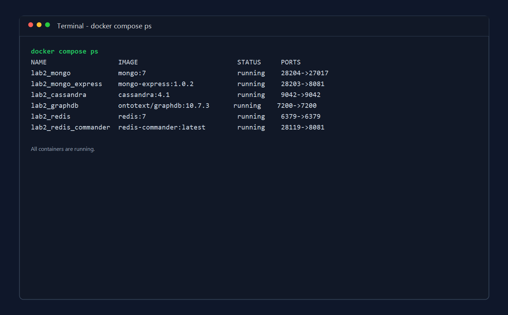
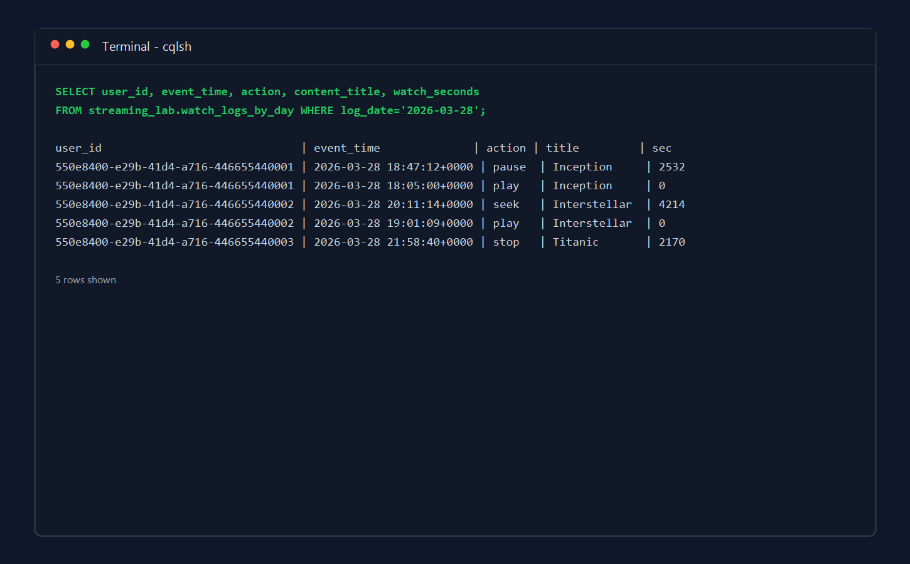
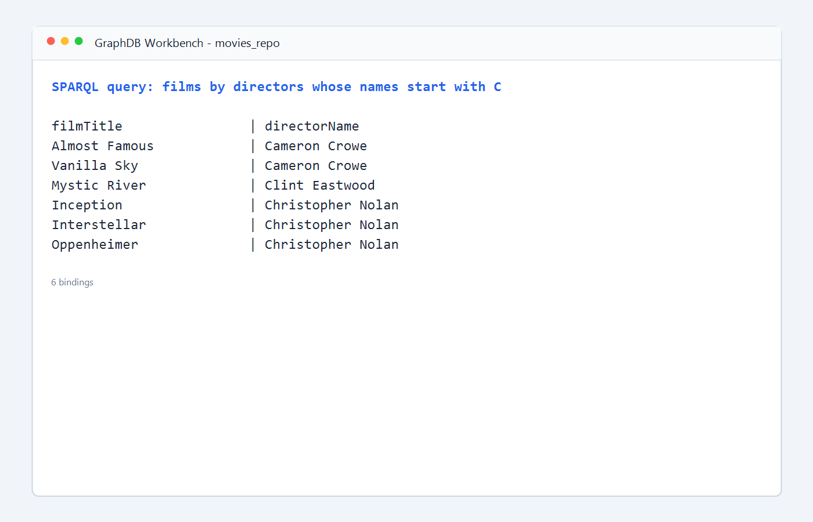
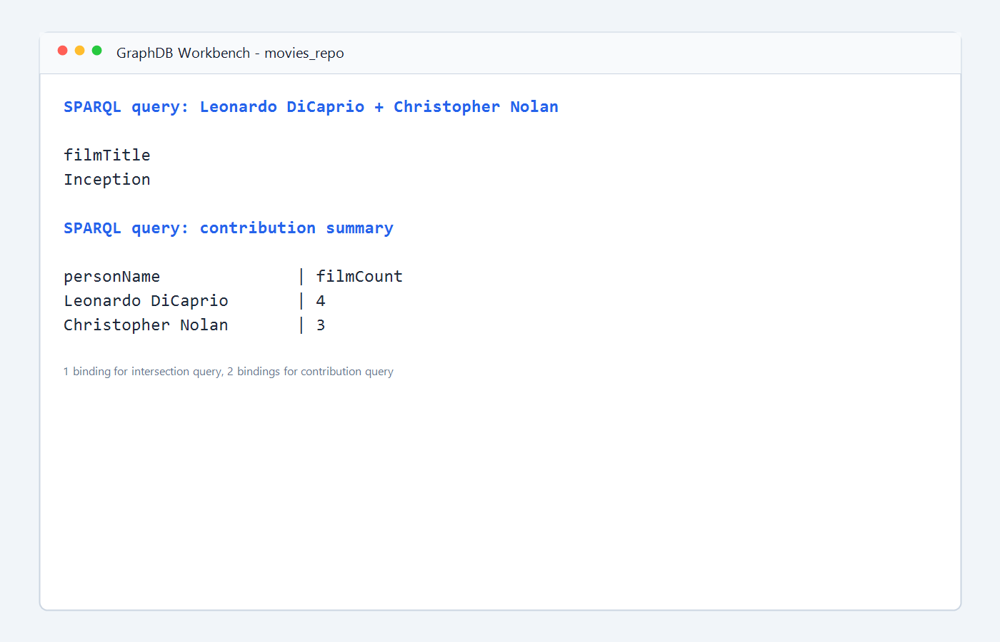

# Лабораторная работа №2

**Дисциплина:** Большие данные  
**Тема:** Полиглотное хранение данных (Polyglot Persistence) для стриминговой платформы  
**Студент:** Войт Иван Иванович  
**Группа:** БД-251м  
**Вариант:** 10

## Структура репозитория

```text
.
|-- docker-compose.yml
|-- README.md
|-- data
|   |-- movies_sample.ttl
|   `-- sample_results.md
|-- screenshots
|   |-- cql_batch_result.png
|   |-- docker_ps.png
|   |-- graphdb_query_1.png
|   `-- graphdb_query_2.png
`-- scripts
    |-- cassandra_batch_logs.cql
    |-- cassandra_queries.cql
    |-- graph_query_contribution.sparql
    |-- graph_query_dicaprio_nolan.sparql
    |-- graph_query_directors_c.sparql
    |-- mongo_crud.js
    `-- mongo_seed.js
```

## Введение

### Бизнес-кейс

В лабораторной работе рассматривается проектирование аналитического ядра для стриминговой платформы, аналогичной Netflix или Кинопоиск. Для работы платформы необходимо хранить и анализировать несколько типов данных:

- каталог контента;
- профили пользователей;
- историю действий пользователей;
- граф связей между фильмами, режиссерами, актерами и жанрами.

Для решения этой задачи используется подход `Polyglot Persistence`, при котором для разных классов данных применяются разные СУБД:

- `MongoDB` для хранения каталога контента и профилей пользователей;
- `Cassandra` для записи потоковых логов действий пользователей;
- `GraphDB` для хранения RDF-графа знаний и выполнения рекомендательных запросов.

### Выбранный стек технологий

- `MongoDB` удобна для документной модели, так как карточки фильмов и профили пользователей могут содержать разные атрибуты.
- `Cassandra` подходит для сценария с высокой интенсивностью записи событий и логов.
- `GraphDB` подходит для анализа связей между сущностями и построения запросов рекомендательного типа.
- `Docker Compose` используется для запуска всей инфраструктуры в единой среде.

## Развертывание

Для запуска среды использовался файл `docker-compose.yml`.

Команда запуска:

```bash
docker compose up -d
```

После запуска были доступны следующие сервисы:

| Сервис | Адрес |
|---|---|
| Mongo Express | `http://localhost:28203` |
| MongoDB | `localhost:28204` |
| Cassandra | `localhost:9042` |
| GraphDB | `http://localhost:7200` |
| Redis Commander | `http://localhost:28119` |

### Скриншот контейнеров



### Скриншот результата работы Cassandra



### Скриншоты запросов GraphDB





## Выполнение задания 1. Cassandra

### Постановка задачи

По варианту 10 требовалось выполнить `Batch`-запрос на вставку нескольких логов одновременно.

### Модель данных

Для хранения логов просмотров выбрана таблица:

```sql
CREATE TABLE watch_logs_by_day (
    log_date date,
    user_id uuid,
    event_time timestamp,
    content_id text,
    content_title text,
    action text,
    device text,
    watch_seconds int,
    PRIMARY KEY ((log_date), user_id, event_time)
) WITH CLUSTERING ORDER BY (user_id ASC, event_time DESC);
```

Обоснование выбора модели:

- `log_date` используется как ключ партиционирования, что позволяет быстро читать события за конкретный день;
- `user_id` и `event_time` используются как кластерные ключи для анализа пользовательской активности;
- структура ориентирована на высокую скорость записи и удобна для хранения потоковых логов.

### Скрипт создания и загрузки данных

Файл: `scripts/cassandra_batch_logs.cql`

```sql
CREATE KEYSPACE IF NOT EXISTS streaming_lab
WITH replication = {'class': 'SimpleStrategy', 'replication_factor': 1};

USE streaming_lab;

DROP TABLE IF EXISTS watch_logs_by_day;

CREATE TABLE watch_logs_by_day (
    log_date date,
    user_id uuid,
    event_time timestamp,
    content_id text,
    content_title text,
    action text,
    device text,
    watch_seconds int,
    PRIMARY KEY ((log_date), user_id, event_time)
) WITH CLUSTERING ORDER BY (user_id ASC, event_time DESC);

BEGIN BATCH
INSERT INTO watch_logs_by_day (log_date, user_id, event_time, content_id, content_title, action, device, watch_seconds)
VALUES ('2026-03-28', 550e8400-e29b-41d4-a716-446655440001, '2026-03-28 18:05:00+0000', 'MOV001', 'Inception', 'play', 'Smart TV', 0);

INSERT INTO watch_logs_by_day (log_date, user_id, event_time, content_id, content_title, action, device, watch_seconds)
VALUES ('2026-03-28', 550e8400-e29b-41d4-a716-446655440001, '2026-03-28 18:47:12+0000', 'MOV001', 'Inception', 'pause', 'Smart TV', 2532);

INSERT INTO watch_logs_by_day (log_date, user_id, event_time, content_id, content_title, action, device, watch_seconds)
VALUES ('2026-03-28', 550e8400-e29b-41d4-a716-446655440002, '2026-03-28 19:01:09+0000', 'MOV004', 'Interstellar', 'play', 'Web', 0);

INSERT INTO watch_logs_by_day (log_date, user_id, event_time, content_id, content_title, action, device, watch_seconds)
VALUES ('2026-03-28', 550e8400-e29b-41d4-a716-446655440002, '2026-03-28 20:11:14+0000', 'MOV004', 'Interstellar', 'seek', 'Web', 4214);

INSERT INTO watch_logs_by_day (log_date, user_id, event_time, content_id, content_title, action, device, watch_seconds)
VALUES ('2026-03-28', 550e8400-e29b-41d4-a716-446655440003, '2026-03-28 21:22:33+0000', 'MOV006', 'Titanic', 'play', 'Mobile', 0);

INSERT INTO watch_logs_by_day (log_date, user_id, event_time, content_id, content_title, action, device, watch_seconds)
VALUES ('2026-03-28', 550e8400-e29b-41d4-a716-446655440003, '2026-03-28 21:58:40+0000', 'MOV006', 'Titanic', 'stop', 'Mobile', 2170);
APPLY BATCH;
```

### Проверочные запросы

Файл: `scripts/cassandra_queries.cql`

```sql
USE streaming_lab;

SELECT * FROM watch_logs_by_day
WHERE log_date = '2026-03-28';

SELECT user_id, event_time, content_title, action, watch_seconds
FROM watch_logs_by_day
WHERE log_date = '2026-03-28'
  AND user_id = 550e8400-e29b-41d4-a716-446655440001;
```

### Результат

После выполнения `BATCH`-запроса в таблицу были вставлены 6 логов просмотра. Данные успешно читаются по дате и по пользователю, что подтверждает корректность структуры таблицы и корректную загрузку данных.

### Дополнительно по MongoDB

Хотя вариант 10 выполняется через Cassandra, в репозитории также подготовлены скрипты для MongoDB:

- `scripts/mongo_seed.js` — заполнение коллекций `users` и `content`;
- `scripts/mongo_crud.js` — примеры `find` и `update`.

Пример CRUD-операций:

```javascript
use("streaming_lab");

db.content.find({ director: "Christopher Nolan" });

db.users.updateOne(
  { _id: "USR002" },
  { $set: { plan: "premium" } }
);

db.users.find({ plan: "premium" });
```

Это показывает, что в полиглотной системе MongoDB может использоваться для хранения профилей и каталога, а Cassandra — для событийной истории.

## Выполнение задания 2. GraphDB / SPARQL

### Подготовка графа

В GraphDB был создан репозиторий `movies_repo`, в который загружен RDF-файл `data/movies_sample.ttl`.

Фрагмент данных:

```turtle
@prefix ex: <http://example.org/movies#> .

ex:ChristopherNolan a ex:Director ;
    ex:name "Christopher Nolan" .

ex:LeonardoDiCaprio a ex:Actor ;
    ex:name "Leonardo DiCaprio" .

ex:Film_Inception a ex:Film ;
    ex:title "Inception" ;
    ex:directedBy ex:ChristopherNolan ;
    ex:hasActor ex:LeonardoDiCaprio .
```

### Запрос 1. Найти фильмы режиссеров на букву C

Файл: `scripts/graph_query_directors_c.sparql`

```sparql
PREFIX ex: <http://example.org/movies#>

SELECT ?filmTitle ?directorName
WHERE {
  ?film a ex:Film ;
        ex:title ?filmTitle ;
        ex:directedBy ?director .
  ?director ex:name ?directorName .
  FILTER regex(?directorName, "^C", "i")
}
ORDER BY ?directorName ?filmTitle
```

Результат:

| filmTitle | directorName |
|---|---|
| Almost Famous | Cameron Crowe |
| Vanilla Sky | Cameron Crowe |
| Mystic River | Clint Eastwood |
| Inception | Christopher Nolan |
| Interstellar | Christopher Nolan |
| Oppenheimer | Christopher Nolan |

### Запрос 2. Найти фильмы с участием Leonardo DiCaprio и Christopher Nolan

Файл: `scripts/graph_query_dicaprio_nolan.sparql`

```sparql
PREFIX ex: <http://example.org/movies#>

SELECT ?filmTitle
WHERE {
  ?film a ex:Film ;
        ex:title ?filmTitle ;
        ex:directedBy ?director ;
        ex:hasActor ?actor .
  ?director ex:name "Christopher Nolan" .
  ?actor ex:name "Leonardo DiCaprio" .
}
ORDER BY ?filmTitle
```

Результат:

| filmTitle |
|---|
| Inception |

### Итог по GraphDB

SPARQL-запросы составлены корректно и позволяют:

- искать фильмы по признаку режиссера;
- искать пересечение по нескольким связанным сущностям;
- использовать графовую модель для задач рекомендаций и семантического поиска.

## Выполнение задания 3. Бизнес-аналитика

### Запрос на оценку вклада Кристофера Нолана и Леонардо Ди Каприо

Файл: `scripts/graph_query_contribution.sparql`

```sparql
PREFIX ex: <http://example.org/movies#>

SELECT ?personName (COUNT(DISTINCT ?film) AS ?filmCount)
WHERE {
  VALUES ?personName { "Christopher Nolan" "Leonardo DiCaprio" }

  ?film a ex:Film .

  {
    ?film ex:directedBy ?person .
  }
  UNION
  {
    ?film ex:hasActor ?person .
  }

  ?person ex:name ?personName .
}
GROUP BY ?personName
ORDER BY DESC(?filmCount)
```

Результат:

| personName | filmCount |
|---|---:|
| Leonardo DiCaprio | 4 |
| Christopher Nolan | 3 |

### Анализ результата

На используемом наборе данных Леонардо Ди Каприо встречается в большем числе фильмов, чем Кристофер Нолан. Это означает, что актер формирует более широкий контентный охват и может использоваться как сильный фактор расширения рекомендаций.

Кристофер Нолан, в свою очередь, представлен меньшим числом фильмов, но эти фильмы образуют более тематически связную группу. Это делает его удобной опорной точкой для более точных рекомендаций внутри определенного жанрового и стилевого сегмента.

Также важен результат второго запроса: фильм `Inception` является точкой пересечения между режиссером Кристофером Ноланом и актером Леонардо Ди Каприо. Такой фильм может использоваться как центральный объект в рекомендательной логике платформы.

### Бизнес-вывод

Для стриминговой платформы можно сделать следующий вывод:

- подборки по Леонардо Ди Каприо подходят для расширения рекомендательной выдачи и увеличения охвата;
- подборки по Кристоферу Нолану подходят для более точных тематических рекомендаций;
- фильмы, в которых одновременно присутствуют сильный режиссерский бренд и популярный актер, являются наиболее ценными для персонализированных рекомендаций.

Следовательно, в рамках платформы целесообразно комбинировать актеро-ориентированные и режиссеро-ориентированные сценарии рекомендаций.

## Выводы

В рамках лабораторной работы была спроектирована и подготовлена полиглотная система хранения данных для стриминговой платформы.

Основные результаты:

- подготовлена инфраструктура на основе `Docker Compose`;
- реализована загрузка событийных логов в `Cassandra` через `BATCH`;
- подготовлены документные данные для `MongoDB`;
- загружен RDF-граф в `GraphDB` и выполнены SPARQL-запросы;
- проведена аналитическая интерпретация результатов.

Преимущества полиглотного подхода:

- `GraphDB` удобна для анализа сложных связей между сущностями;
- `Cassandra` эффективна для записи большого количества событий;
- `MongoDB` удобна для хранения гибких документных структур;
- каждая СУБД используется в задаче, для которой она подходит лучше всего.

Таким образом, подход `Polyglot Persistence` позволяет строить более эффективные аналитические и рекомендательные системы, чем использование одной универсальной СУБД для всех типов данных.
